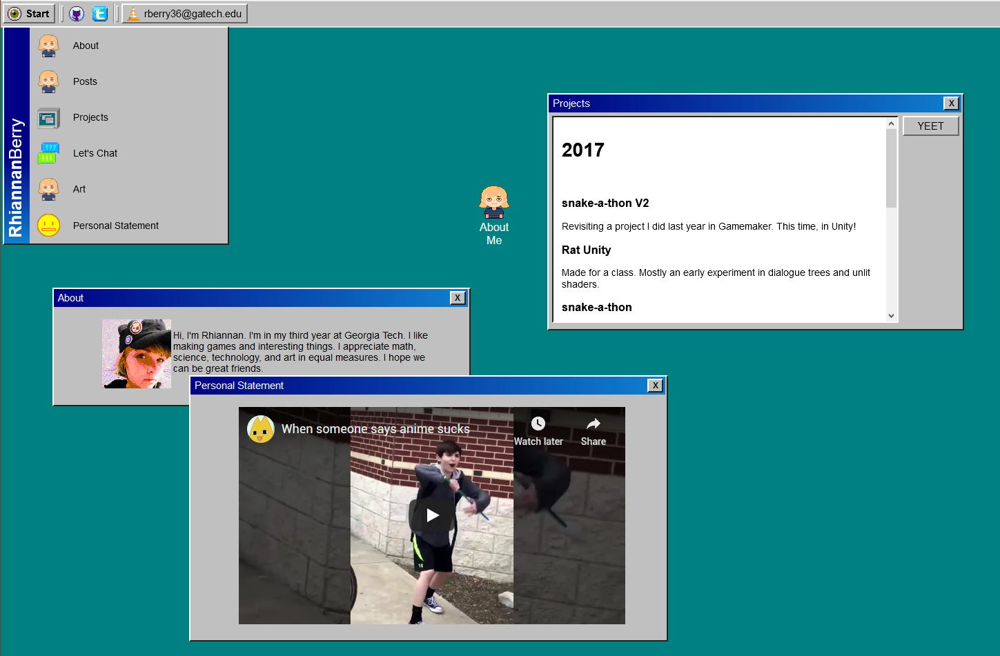
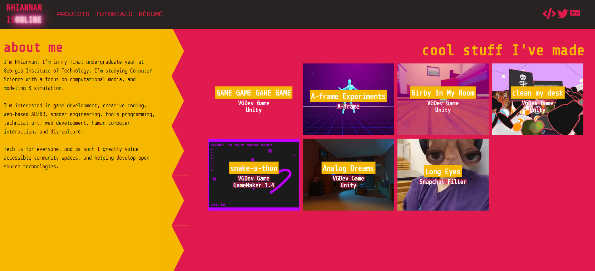
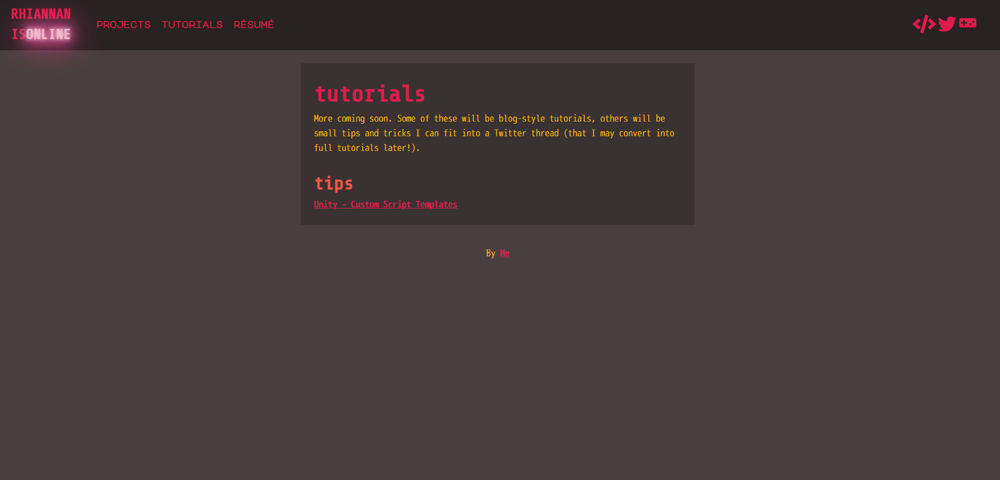
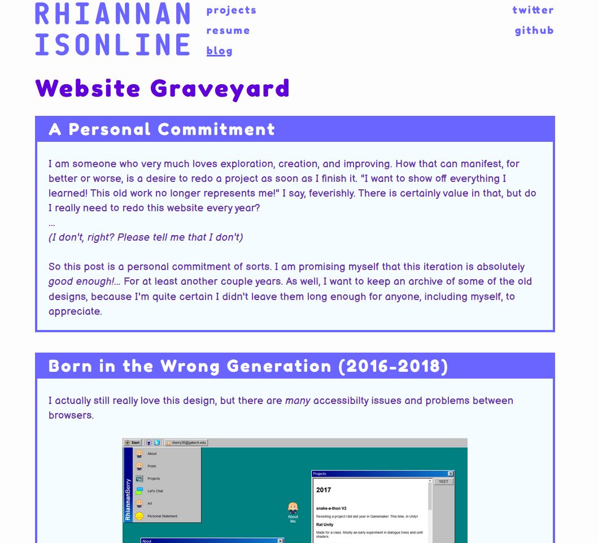

---

date: 2020-08-05
title: "Website Archive"
summary: "\"HEY, WHAT IF I RE-DID MY PERSONAL WEBSITE AGAIN?\" - me, ad infinitum"
thumbnail: ../images/website-graveyard-1.png
tags: ["aframe", "2018", "XR", "OSS"]
featured: false
---

::: div con
## A Personal Commitment

I am someone who very much loves exploration, creation, and improving. How that can manifest, for better or worse, is a desire to redo a project as soon as I finish it. "I want to show off everything I learned! This old work no longer represents me!" I say, feverishly. There is certainly value in that, but do I really need to redo this website every year?
 
...
 
*(I don't, right? Please tell me that I don't)*

So this post is a personal commitment of sorts. I am promising myself that this iteration is absolutely *good enough!*... For at least another couple years. As well, I want to keep an archive of some of the old designs, because I'm quite certain I didn't leave them long enough for anyone, including myself, to appreciate.
:::

::: div con
## Born in the Wrong Generation (2016-2018)

I actually still really love this design, but there are *many* accessibilty issues and problems between browsers.

>>>>>

Oh, and to clarify, the title is a joke. I might be a zoomer/millenial cusp (zillenial?) but I grew up using Windows 95 and 98. I'm not *that* young.

:::

::: div con
## Sonic 2 Level Transition (2019-2020)

Not the most cohesive design. This was done with Jekyll and is actually the second or third iteration, though the earlier versions have been lost to the sands of time. 

>>>>>
>>>>>

Great learning experience in terms of functionality, debatable in terms of visual quality.

:::

::: div con
## I Don't Actually Like Dark Mode (2020-Eternity)

Whoa. Meta.

>>>>>

:::