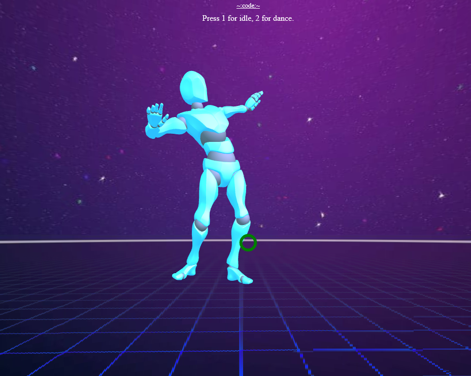
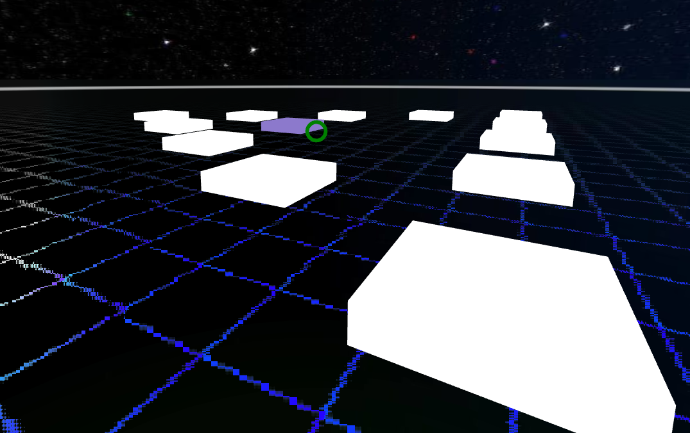

---

date: 2018-04-23
id: "a-frame"
title: "A-Frame Bits"
summary: "Little projects to familiarize myself with A-Frame"
thumbnail: ../images/a-frame-1.png
tags: ["aframe", "2018", "XR", "OSS"]
featured: false
---

::: div block
## Details 📝

#### [Code Repository](https://github.com/rhiannanberry/A-Frame-Experiments)

### Description
I got the opportunity to work with __AEL__[^ael] at Georgia Tech, and these are some little things I worked on to familiarize myself with __A-Frame__[^aframe].

### Demos
[Animation Rig](/REPLACE)
Quick and dirty example of how you can associate the animations of one FBX to the mesh/rig of a different FBX (given that they have the same armature/bones). 

>>>>>

---

[Waypoints](/REPLACE)
Playing with generating waypoints in different shapes, as well as reactively revealing these waypoints.

>>>>>

:::

## Notes
[^ael]: [AEL](https://gvu.gatech.edu/research/labs/augmented-environments-lab) Augmented Environments Lab at Georgia Tech
[^aframe]: [aframe.io](https://aframe.io) A-Frame is a popular, open source VR web framework

