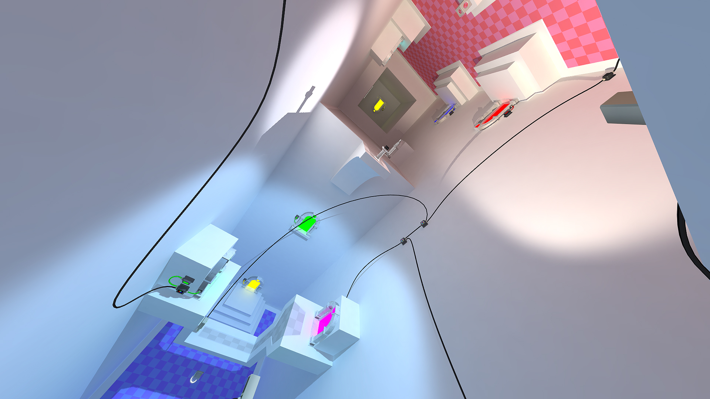
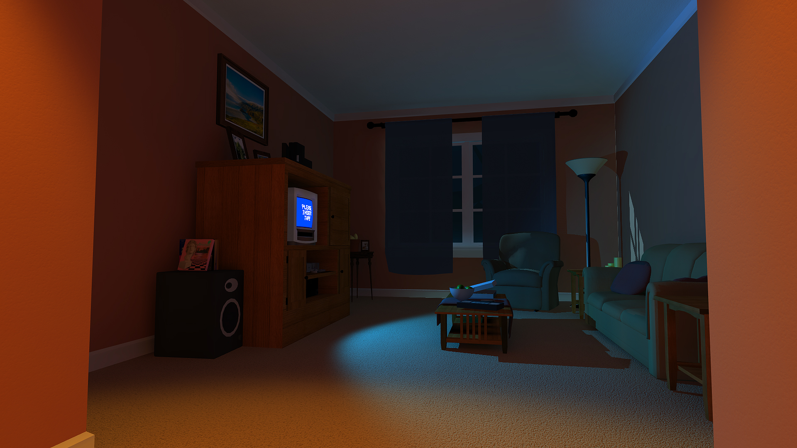

---

date: 2016-04-23
id: "analog-dreams"
title: "Analog Dreams"
summary: "Physics & gravity puzzle game. Just put the VHS tape in the VCR :)"
thumbnail: ../images/analog-dreams-1.jpg
tags: ["unity", "game", "VGDev", "2016"]
featured: false
---

::: div block
## Details 📝
## [Play Analog Dreams here!](http://vgdev.com/game/analog-dreams, "Analog Dreams VGDev Download Page")
### Description
Physics & gravity puzzle game. Just put the VHS tape in the VCR :) Completed during spring 2016 semester Georgia Tech, as a part of __VGDev__[^vgdev], [^project]. 

### Goals
First and foremost, my goal was to lead a game to completion and create some engaging puzzles along the way. This was only the second game dev project I worked on with a team, and the first time I would be leading. I co-led the project with a very talented friend of mine, [Sean Flanagan](https://sflanagan33.github.io)

### Accomplishments
This was my first experience in project leading and also sharing a leadership role. This project also features the first 3D space, featured in the first screenshot, that I modeled, textured, and lit entirely from scratch! The initial story I proposed is wildly different to the result, but that in itself, was a great learning experience.

### Key Responsibilities
Project leading, level design, 3D modeling.

:::

::: div block
## Trailer 📹

    <iframe style="position:absolute;top:0;left:0;width:100%;height:100%;"  src="https://www.youtube.com/embed/1gUOLWTrk1g" frameborder="0" allow="accelerometer; autoplay; encrypted-media; gyroscope; picture-in-picture" allowfullscreen></iframe>

:::

::: div block
## Screenshots 📷

:::

## Notes
[^vgdev]: [VGDev](http://vgdev.com) Georgia Tech's game development club
[^project]: [Analog Dreams on VGDev](http://vgdev.gtorg.gatech.edu/game/analog-dreams) Download page and credits
