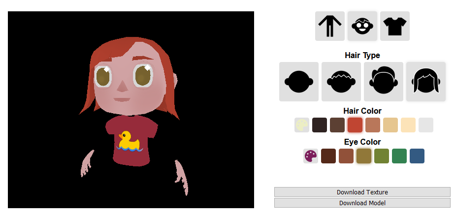

---

date: 2020-04-23
id: "avatar-customizer"
title: Custom Hubs Avatars
summary: "An avatar customization web tool built for Mozilla Hubs."
thumbnail: ../images/avatar-customizer-1.png
tags: ["React", "OSS", "XR", "2020"]
featured: false
---

::: div block
## Details 📝

## [Play with the avatar customizer here!](https://rhiannanberry.github.io/Avatar-Customizer)
#### [Code Repository](https://github.com/rhiannanberry/Avatar-Customizer)

### Description

Web-based avatar customizer to be used on __Mozilla Hubs__[^hubs]. I developed this as a part of my research with __AEL__[^ael]. It's still in active development, too!

### Goals

The goal here was to let Hubs users create a more custom and humanoid avatar than the pre-existing robotic avatars readily available on Hubs. It needed to have an easy workflow, and a broad set of options to support a variety of people, as our research lab was preparing for two VR conferences that would *take place* in VR. 

Also, I wanted to dip my toes into "real" open source development for the first time, as this tool would have the opportunity to be a part of Mozilla's codebase. 

### Accomplishments

Accomplished almost everything I was going for! We got to see lots of people repping custom avatars at the __IEEEVR 2020 conference__[^conf], and I'm told many are still using them months later :) 

[Here's](https://twitter.com/search?q=avatar%20(%40rhiannan_online)&src=typed_query&f=image) just a few Tweets I got of people sharing them with me!

The project is still in progress, though, so there is still plenty of ways to improve and expand! Once my hiatus is over, I plan on vastly expanding available hairstyles, facial hair, and accessories, and improving UI and code-readability.

:::

::: div block
## Screenshots 📷

:::

## Notes
[^hubs]: [Mozilla Hubs](https://hubs.mozilla.com/#/) Mozilla's open source web-based platform for VR gatherings
[^ael]: [AEL](https://gvu.gatech.edu/research/labs/augmented-environments-lab) Augmented Environments Lab at Georgia Tech
[^conf]: http://ieeevr.org IEEEVR 2020 Conference page
