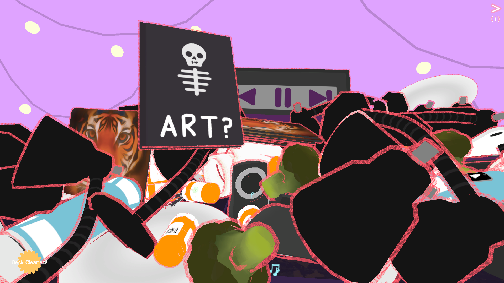
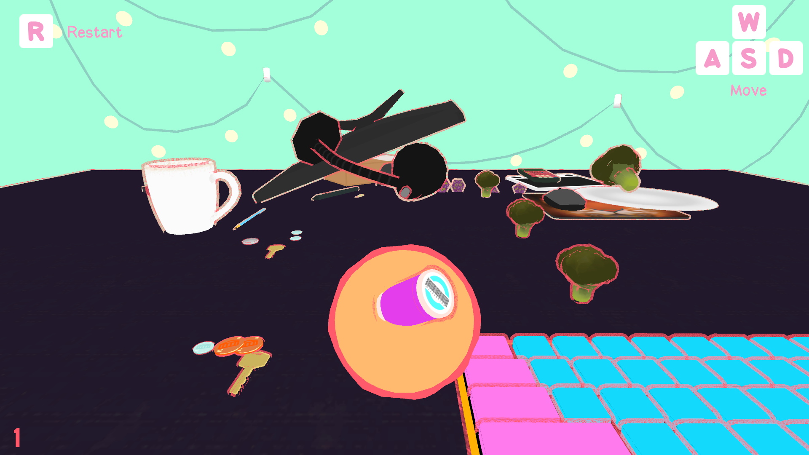
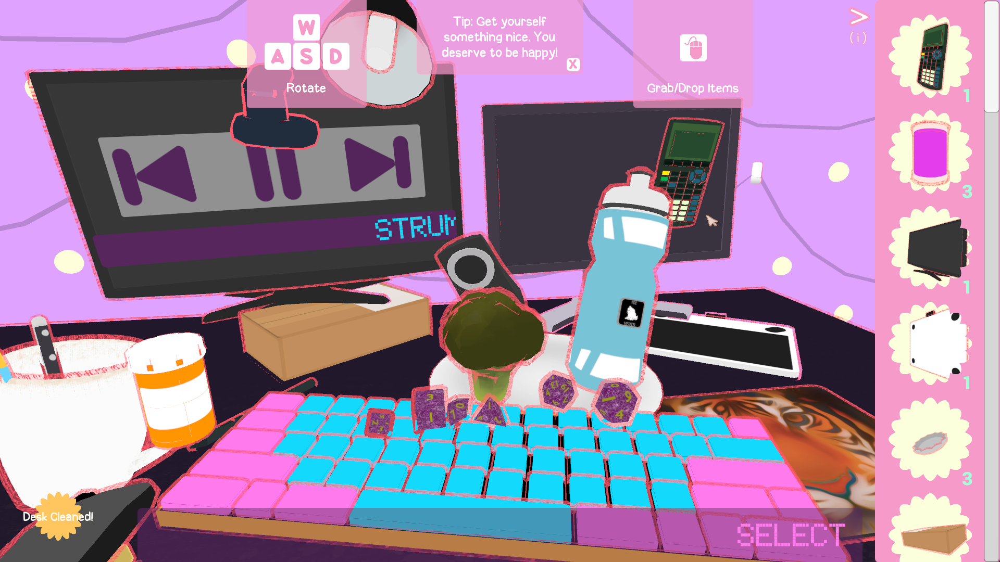

::: div block
## Details 📝
## [Play clean my desk here!](http://vgdev.com/game/clean-my-desk, "clean my desk VGDev Download Page")
#### [Code Repository](https://github.com/rhiannanberry/Clean-My-Desk)
### Description

Physics-based desk organization game made while procrastinating cleaning my irl desk. Completed during spring 2018 semester at Georgia Tech, as a part of __VGDev__[^vgdev], [^project].

### Goals

CMD started genuinely started as a way for me to procrastinate cleaning my real desk, and as 3D modeling practice, so the earliest goal was getting better at modeling props. Once I decided to convert this into a fully fledged game, my focus was on creating a chaotic but friendly aesthetic I pictured in my head, and to learn shader and editor development in Unity. I was very much inspired by games like Jet Set Radio and Katamari Damacy, and the entire body of work from [Nathalie Lawhead](https://alienmelon.itch.io/, "Nathalie's itch.io").

### Accomplishments

I learned a LOT about shaders and editor development! This is also the first large project where I really started to find my "style". It is arguably the least "game-like" game I led in VGDev, but players I've spoken to about or watched play CMD seem to "get" and like what I was going for and would always leave with a smile :)

### Key Responsibilities

Project leading, general programming, shader and editor programming, design, 3D modeling.

:::

::: div block
## Screenshots 📷

::: div inline-image

:::

:::

## Notes
[^vgdev]: [VGDev](http://vgdev.com) Georgia Tech's game development club
[^project]: [clean my desk on VGDev](http://vgdev.com/game/clean-my-desk) Credits and download page
