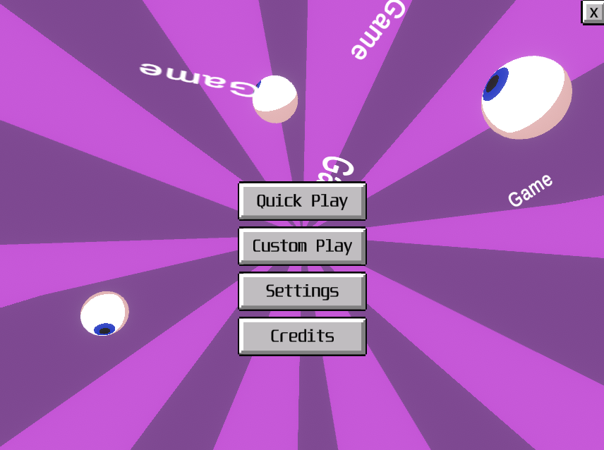
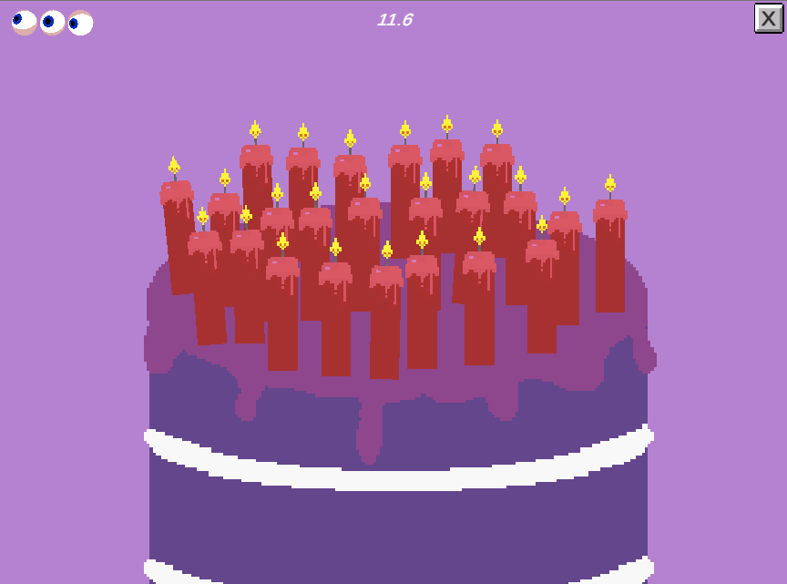
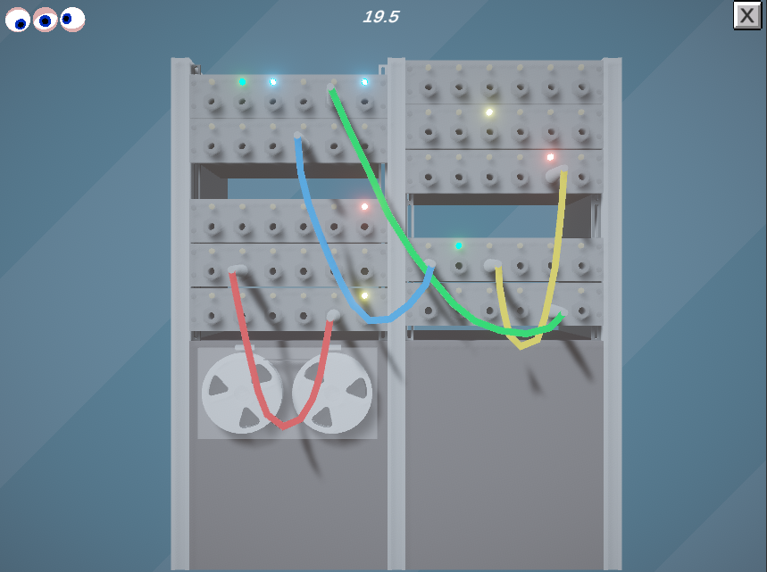
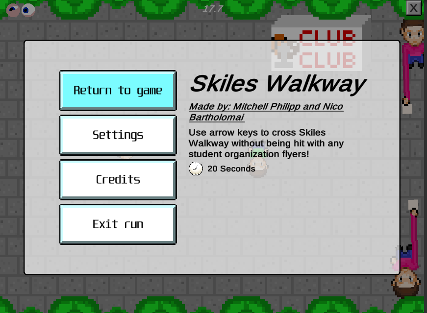
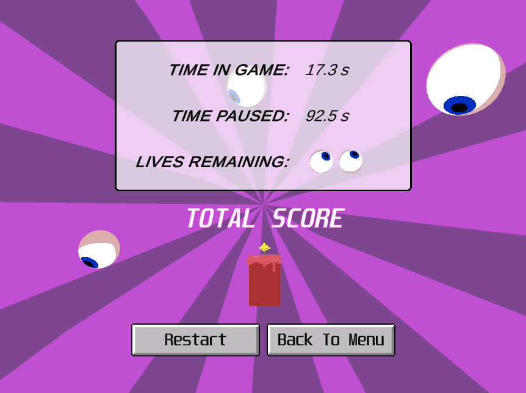

---

date: 2019-12-23
id: "g4me"
title: "GAME GAME GAME GAME"
summary: "A minigame game made in Unity."
thumbnail: ../images/g4me-1.png
tags: ["unity", "game", "VGDev", "2019", "OSS"]
featured: false
---

::: div block
## Details 📝

#### [Code Repository](https://github.com/rhiannanberry/GameGameGameGame)

### Description

A collection of short 2D and 3D minigames, a la Warioware or the Four Second Fury series. Completed during fall 2019 semester at Georgia Tech, as part of __VGDev__[^vgdev].

### Goals

The primary goal here was to create a very flexible framework that would allow new members to practice making their own minigames without much experience, and still be able to show them off. So ultimately, this was intended to be a platform for teaching and presentation.

### Accomplishments

I learned a massive amount about Unity, C#, and creating a user friendly framework. The framework could use (another) rewrite now that I've had time to reflect on the pain points, particularly my weak documentation, but I really love the aesthetic we acheived and how quickly someone versed in the project structure could produce a cute and snappy little vignette! In addition to focusing on building out a minigame framework, I also leveled up my Unity editor programming skills, and devoted a lot of time to UI design.

### Key Responsibilities

Project Leading, programming, UI design, level design.

:::

::: div block
## Screenshots 📷

::: div inline-image

:::

::: div inline-image

:::

:::

## Notes
[^vgdev]: [VGDev](http://vgdev.com) Georgia Tech's game development club
