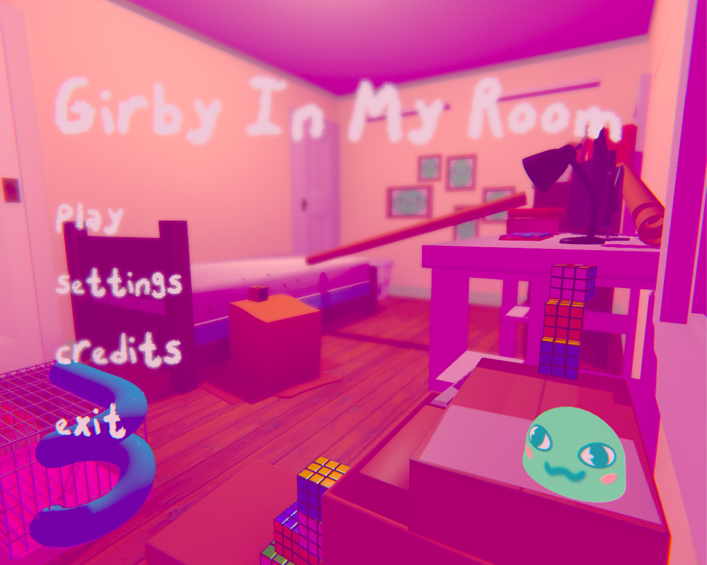

::: div block
## Details 📝

## [Play Girby In My Room here!](http://vgdev.com/game/girby-in-my-room)
#### [Code Repository](https://github.com/rhiannanberry/GirbyInMyRoom)

### Description

Small, open world platformer where you play as cute round friend, Girby, and run errands for the various bugs in my room! 

Completed during fall 2018 semester at Georgia Tech, as a part of __VGDev__[^vgdev], [^project].

### Goals

Two explicit goals I had from the beginning were creating a unique player controller, and creating an actual narrative and characters. I wanted contributors to the project to be able to create their own characters within the loose narrative. I was really interested in collaborative projects where you could see the individual voices within the work, so trying to balance style coherence and dissonance *simultaneously* (don't think about it too much) is what I was going for.

### Accomplishments

It's, pardon the pun, quite *buggy* and the player controller is a bit clunky, but I had a lot of fun and learned a huge amount. I feel like we were on the right path with the chaotic aesthetic, but we definitely could have benefited from having more props and places for Girby to explore. It was quite a large undertaking for one semester, and definitely showed me that project management and team communication is something I needed to work on!

### Key Responsibilities

Project leading, level design, general programming, shader and editor programming.

:::

::: div block
## Screenshots 📷

::: div inline-image

:::

:::

## Notes
[^vgdev]: [VGDev](http://vgdev.com) Georgia Tech's game development club
[^project]: [Girby In My Room on VGDev](http://vgdev.gtorg.gatech.edu/game/girby-in-my-room) Download page and credits