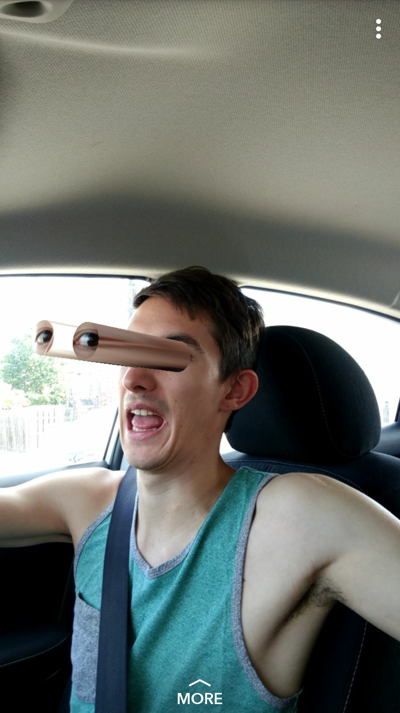

::: div block
## Details 📝

### Description

Snapchat filter inspired by experiments from [Zach Lieberman](https://twitter.com/zachlieberman "Zach Lieberman's Twitter")... The name says it all, really 👀.

### Goals

I made this filter the week Snapchat's Lens Studio was released in beta, and my goal was to familiarize myself with the software and dip my toe into AR.

### Accomplishments

I got a really good overview of Lens Studio, and I later discovered that my filter had amassed 100k uses 🔥🔥🔥! Unfortunately, filters and data analytics from this version of Lens Studio are defunct an inaccesible now, but maybe I'll go back and remake this!.... Some day......

:::

::: div block
## Screenshots 📷

::: div inline-image
 

:::

:::