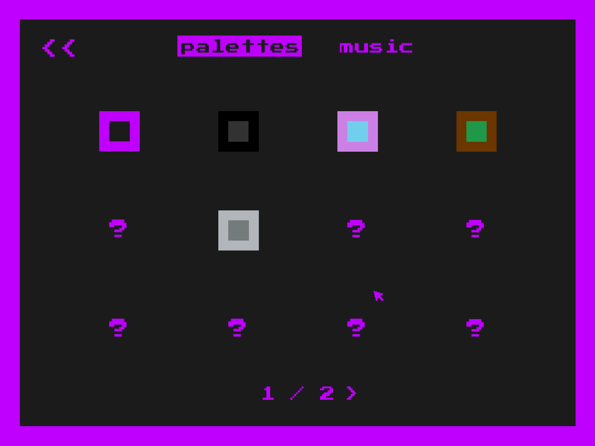

::: div block
## Details 📝
## [Play snake-a-thon here!](http://vgdev.com/game/snake-a-thon, "snake-a-thon VGDev Download Page")
### Description

Like the classic game Snake, but wiggly-er and more  💥 __*ACTION PACKED*__ 💥.  The snake chases down your mouse, and you must direct it to pick up food or powerups without letting it actually touch the mouse, obstacles, or itself. It was completed during spring 2017 semester Georgia Tech, as a part of __VGDev__[^vgdev] , [^project]. 

### Goals

My goal with snake-a-thon was to (solo) lead my first game and create something inspired by game mechanics and aesthetics that I was really into at the time. This game is heavily inspired by Downwell, Achievement Unlocked, and Binding of Isaac (basically just the proc gen elements).

### Accomplishments

We didn't get in as many power-ups and acheivments as we wanted, but I think we did a really great job at creating a genuinely super fun and replayable game. In the framing of VGDev, where we force ourselves to complete a game in one semester, I think this project was very well scoped, too. This is *very* much a project I would love to recreate in Unity and make it availble for web and mobile platforms (if only for myself to play, hehe).

### Key Responsibilities

Project leading, programming, designing mechanics.

:::

::: div block
## Screenshots 📷

::: div inline-image
 

:::

:::

## Notes
[^vgdev]: [VGDev](http://vgdev.com) Georgia Tech's game development club
[^project]: [snake-a-thon on VGDev](http://vgdev.gtorg.gatech.edu/game/snake-a-thon) Download page and credits